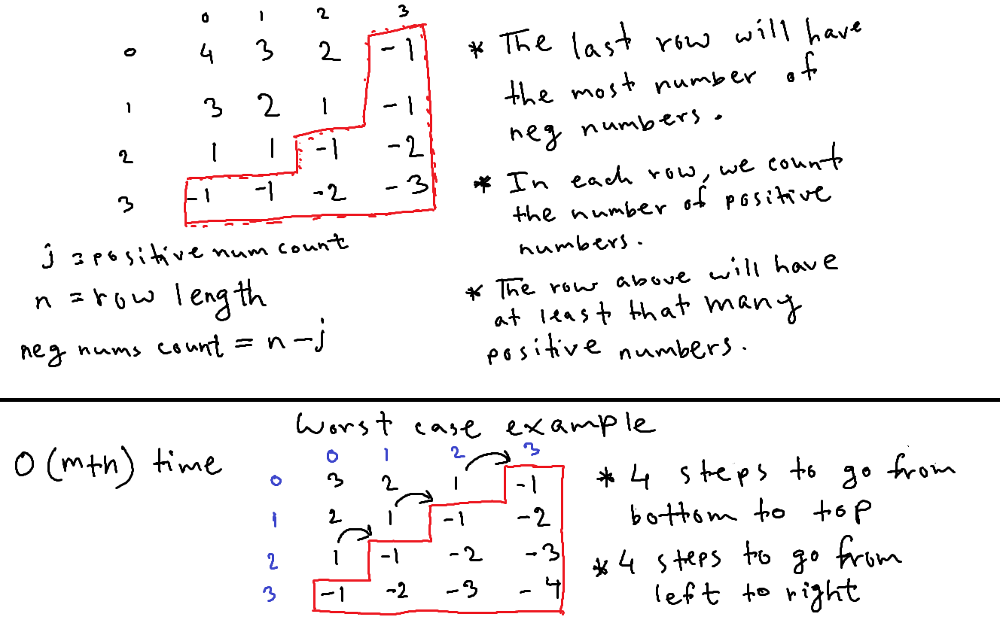

# Count negative numbers in a sorted matrix

| #   | Difficulty | Tag(s)                | Link                                                                                     |
| --- | ---------- | --------------------- | ---------------------------------------------------------------------------------------- |
| 41  | easy       | Binary search, matrix | [View problem](https://leetcode.com/problems/count-negative-numbers-in-a-sorted-matrix/) |

## Approaches

- binary search
- two pointers

### Binary search

- since the inner arrays are sorted in non-increasing order, all numbers after the first negative number will also be negative
- so, we need to find the first negative number in each inner array
- use two pointers to track the start and end position of the current problem space
- find the middle index and see if the middle number is negative or positive
- if `arr[middle]` is positive, then we have to look to the right of it
- if `arr[middle]` is negative and `arr[middle - 1]` is also negative, then we have to go to the left of `middle`
- if `arr[middle]` is negative and `arr[middle - 1]` is positive, then we have found the very first negative number
- the total count of negative numbers will be `arr.length - middleIndex`
- O(mlogn) time complexity
  - m is the number of rows in the matrix
  - n is the number of columns in the matrix
- O(1) time complexity

### Two pointers

- this approach involves tracking the count of positive numbers we have seen so far in a row starting from the bottom-most row
- since the matrix is sorted in non-increasing order, the bottom-most row will have the lowest count of positive numbers
- if a row has `k` positive numbers, we can be certain that the previous row or the row above will have `k` or more positive numbers
  - as we go from bottom to top of the matrix, rows will have larger values
- use a pointer `i` to iterate through each row (starting from last row)
- use a pointer `j` to track the index of the first negative number in a row
  - every time a positive number is encountered, we increment `j`
  - so, if j = 2, it means that the first 2 numbers in the current row are positive
- when we encounter the first negative number in a row, we calculate the count of negative numbers in that row and move to the row above
- the count of negative numbers in a row will be `row.length - j`
- O(m + n) time complexity
  - in the worst case, we will have to loop through all m rows and n columns
  - this will happen when the last row will have all negative numbers and all rows above have a negative number fewer than the row below
- O(1) space complexity

