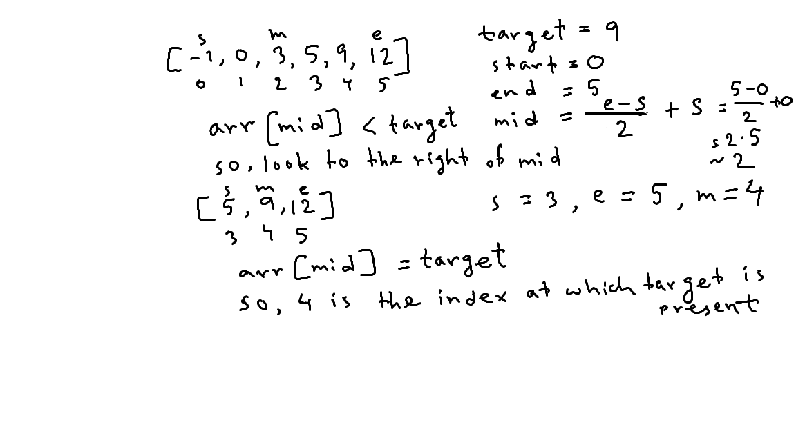

# Binary search

| #   | Difficulty | Tag(s)        | Link                                                         |
| --- | ---------- | ------------- | ------------------------------------------------------------ |
| 35  | easy       | Binary search | [View problem](https://leetcode.com/problems/binary-search/) |

## Approach

- look at the middle number in a portion of the array (the problem space) and compare it with the target
- if the middle number is equal to the target, then we have found the number
- if the middle number is smaller than the target, then we have to search in the portion to the right of the middle number
- if the middle number is greater than the target, then we have to look in the portion to the left of the middle index
- use two pointers to track the start and end position of the problem space (the portion of the array in which we are searching)
- keep searching until start crosses the end pointer
- O(log n) time complexity
  - in each comparison, we halve the problem space
- O(1) space complexity

