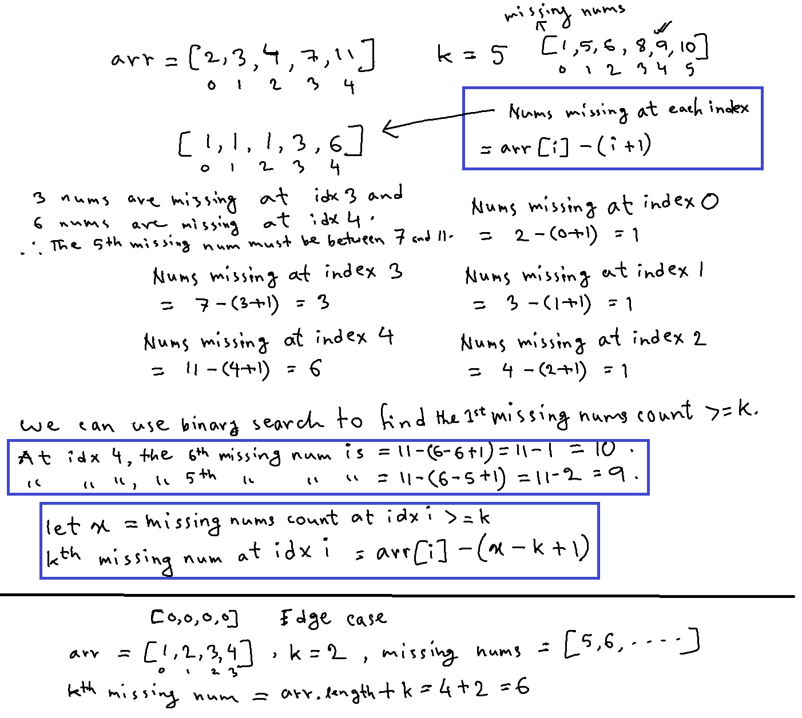

# Kth missing positive number

| #   | Difficulty | Tag(s)                  | Link                                                                       |
| --- | ---------- | ----------------------- | -------------------------------------------------------------------------- |
| 42  | easy       | Hash map, binary search | [View problem](https://leetcode.com/problems/kth-missing-positive-number/) |

## Approaches

- linear search using hash map
- binary search

### Linear search

- use a hash map to store which numbers are present
- loop through 1 until 2000
  - problem states that the largest possible number in the input array is 1000
  - and the largest possible value of k is 1000
  - so, in the worst case, the 1000th missing number will be 2000
- whenever we encounter a missing number, we decrement `k`
- when `k` becomes 0, we have found the kth missing number
- O(m + n) time complexity
  - m is the size of the input array
  - n is 2000
- O(m) space complexity

### Binary search

- this approach involves finding the count of missing numbers at an index, and comparing it with `k`
  - how many numbers are missing until the number at that index?
- we need to find the first index at which `missingNumsCount >= k`
- use two pointers to track the start and end positions of the current problem space
- calculate middle index and find `missingNumsCount` at middle index
- if `missingNumsCount < k`, then the kth missing number must be to the right of `middle`
- if `missingNumsCount >= k && missingNumsCountJustBeforeMid >= k`, then the kth missing number must be to the left of `middle`
- O(log n) time complexity
- O(1) space complexity

