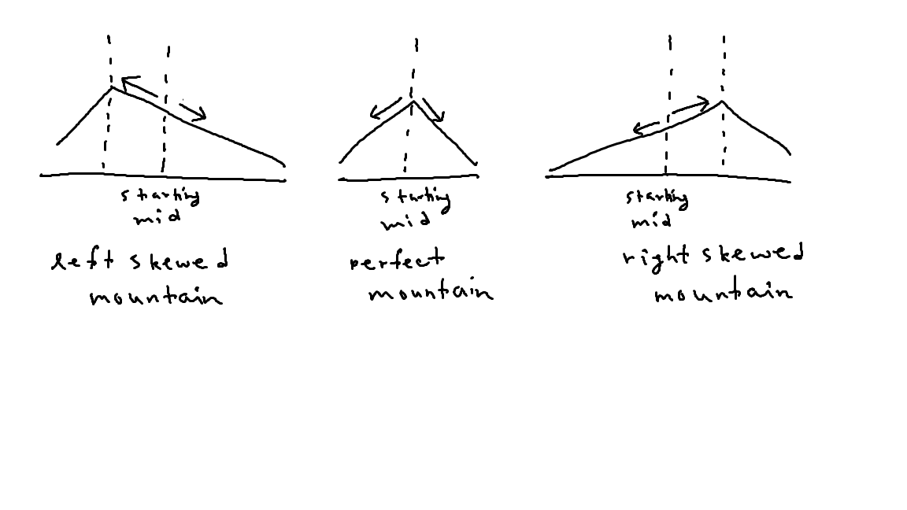

# Peak index in a mountain array

| #   | Difficulty | Tag(s)        | Link                                                                          |
| --- | ---------- | ------------- | ----------------------------------------------------------------------------- |
| 36  | easy       | Binary search | [View problem](https://leetcode.com/problems/peak-index-in-a-mountain-array/) |

## Binary search

- the arr is guaranteed to be a mountain array, so there will be no plateau
- all numbers to the left and right of the peak index are smaller than arr[peakIndex]
- use two pointers to track the start and end positions of the current problem space
- find the middle number in the current problem space and compare it with the immediate numbers around it
- if arr[middle - 1] > arr[middle]
  - this means that the peak must be somewhere to the left of the current middle number (left-skewed mountain)
- if arr[middle + 1] > arr[middle]
  - this means that the peak must be somewhere to the right of the current middle number (right-skewed mountain)
- O(log n) time complexity
- O(1) space complexity

