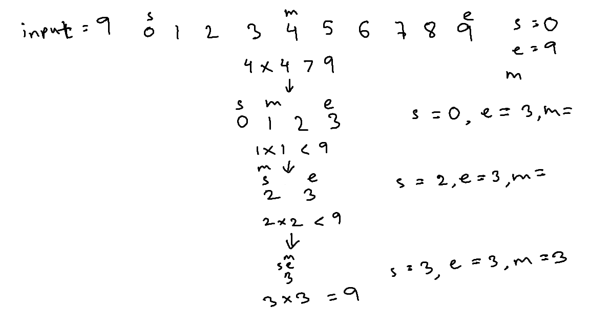

# Valid perfect square

| #   | Difficulty | Tag(s)        | Link                                                                |
| --- | ---------- | ------------- | ------------------------------------------------------------------- |
| 38  | easy       | Binary search | [View problem](https://leetcode.com/problems/valid-perfect-square/) |

## Binary search

- a perfect square is a number that is the product of an integer multiplied by itself
  - e.g. 16 is a perfect square because 4 x 4 = 16
- we can imagine a sorted sequence of numbers starting from 0 and ending at the input number
- we need to find if a number `b` exists between 0 and the input number `a` such that `b * b = a`
- use two pointers to track the upper and lower bound of the problem space
- calculate the middle number and compare `middle * middle` with `a`
- if `middle * middle > a`, then `b` may exist to the left of `middle`
- if `middle * middle < a`, then `b` may exist to the right of `middle`
- if `middle * middle = a`, then we have found `b` and therefore, `a` is a valid perfect square
- if the lower bound crosses the upper bound and we still haven't found `b`, then `a` is not a perfect square
- O(log n) time complexity
- O(1) space complexity

