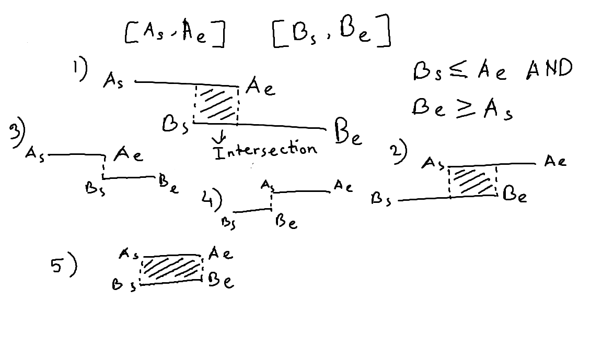

# Interval list intersections

| #   | Difficulty | Tag(s)       | Link                                                                       |
| --- | ---------- | ------------ | -------------------------------------------------------------------------- |
| 32  | Medium     | Two pointers | [View problem](https://leetcode.com/problems/interval-list-intersections/) |

## Two pointers

- use two pointers (i and j) to track intervals from the two lists
- keep looping as long as i and j are within the bounds of their respective lists
- in each iteration, check if there is an intersection between interval 1 and interval 2
  - for the first number of the intersection, take the max of interval1[0] and interval2[0]
  - for the second number of the intersection, take the min of interval1[1] and interval2[1]
- increment i if the larger number of interval 1 is smaller than the larger number of interval 2
  - this is because the next interval from first list could still intersect with interval 2
- increment j if the larger number of interval 1 is greater than the larger number of interval 2
  - this is because the next interval from second list could still intersect with interval 1
- increment both i and j if the larger number of interval 1 is equal to the larger number of interval 2
  - since both intervals end at the same number, we have to go the next intervals in the lists
- O(m + n) time complexity
- O(k) space complexity
  - k is the number of intersections found

